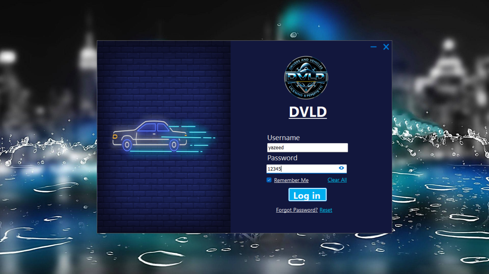
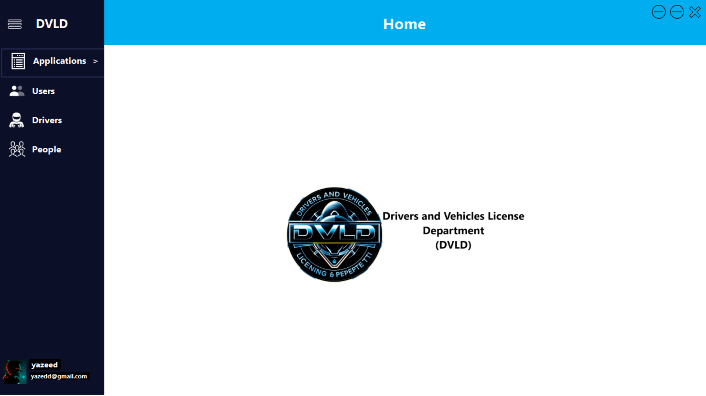
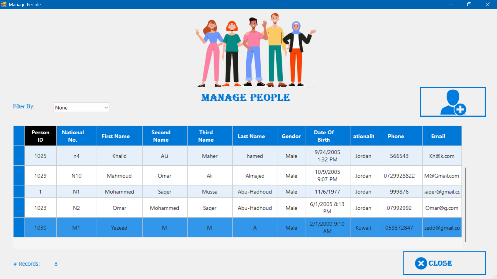
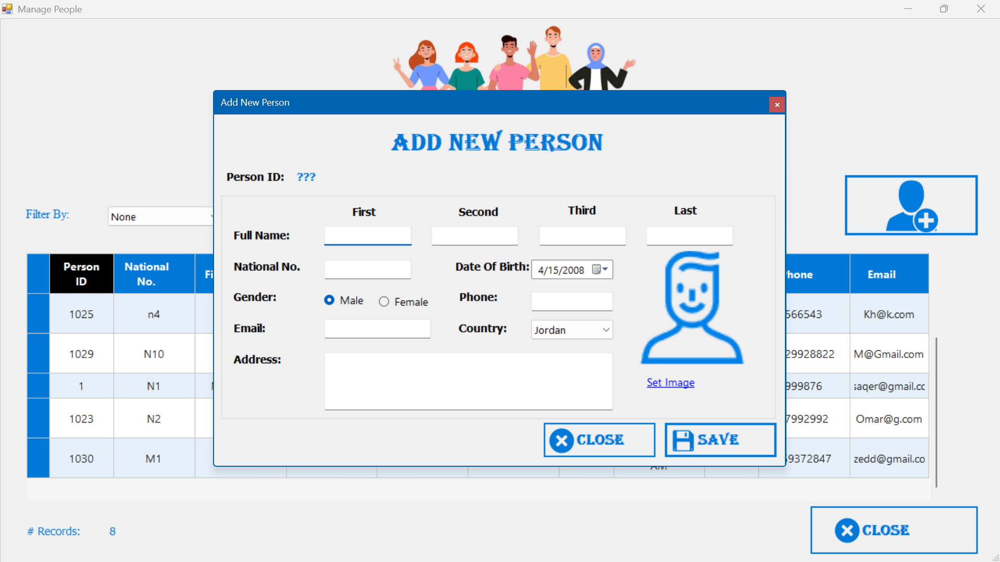
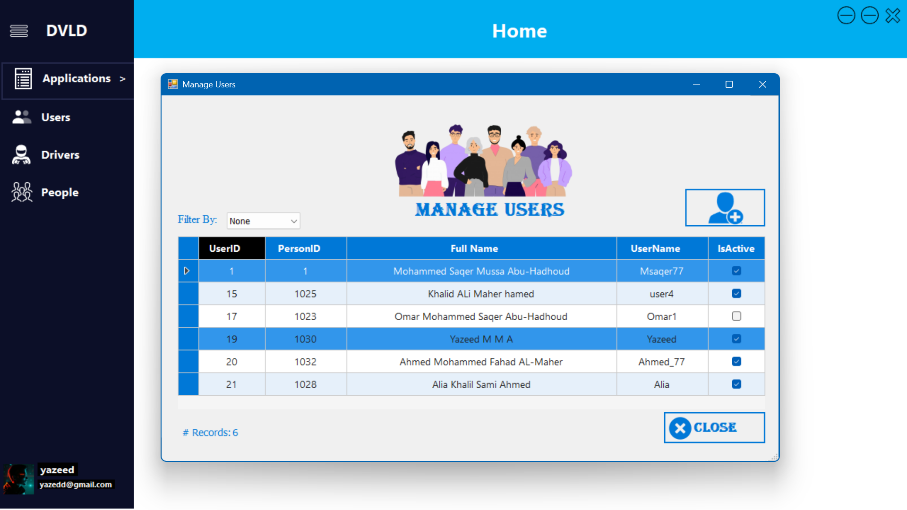
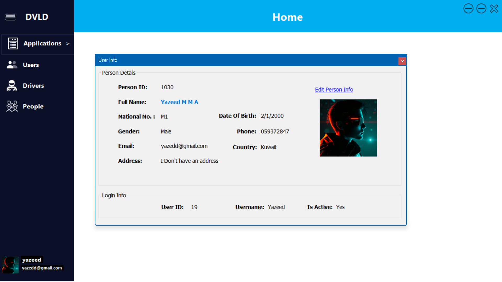
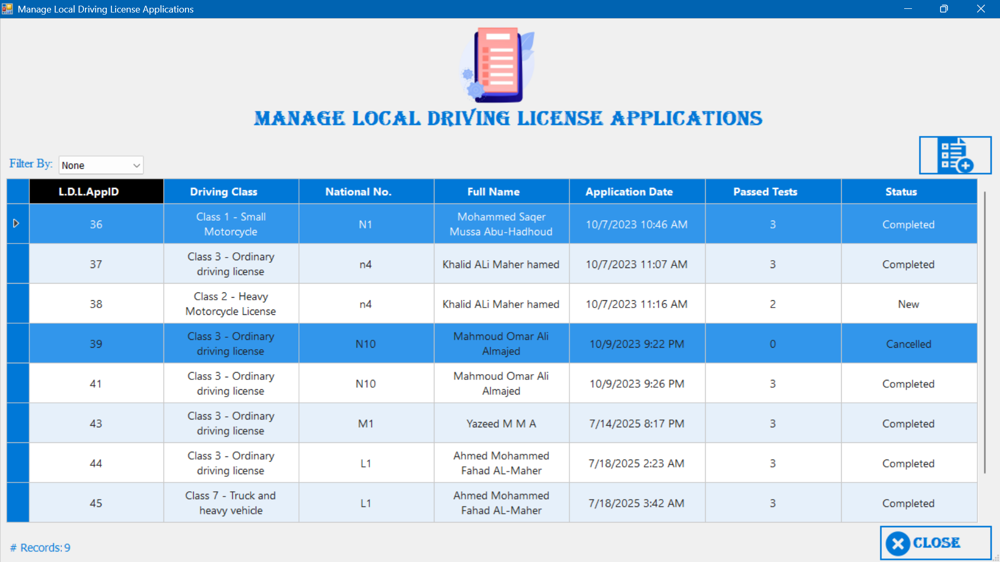

# DVLD System (Driving & Vehicle License Department) 🚗💳

## 📝 About The Project
The **DVLD System** is a comprehensive Windows desktop application designed to manage the complete workflow of a Driving and Vehicle License Department. This project simulates real-world government enterprise systems, handling everything from user management to complex license-issuing processes.

## ✨ Key Features
- **People & Users Management:** Add, update, delete, and view profiles securely.
- **Driving License Applications:**
  - Local & International Driving License Applications.
  - Renewals, Replacements (Lost/Damaged), and Cancellations.
- **Testing System:** Manage Vision, Written, and Practical (Street) tests.
- **Driver Management:** Keep track of drivers' histories, licenses, and records.
- **Detain/Release Licenses:** Manage the detainment of licenses and the payment of fines.

## 🛠️ Technologies & Tools Used
- **Language:** C#
- **Framework:** .NET Framework (Windows Forms / WinForms)
- **Database:** Microsoft SQL Server
- **Architecture:** 3-Tier Architecture (Presentation, Business, and Data Access Layers)

## 📐 Architecture
This project strictly follows the **3-Tier Architecture** to ensure clean code, scalability, and easy maintenance:
1. **Presentation Layer (UI):** Windows Forms designed for the best user experience.
2. **Business Logic Layer (BLL):** Handles the core business rules and validations.
3. **Data Access Layer (DAL):** Manages all database interactions safely and efficiently using ADO.NET.

## 📸 App Screenshots

| Login Screen | Main Menu |
| :---: | :---: |
|  |  |

| Manage People | Add New Person |
| :---: | :---: |
|  |  |

| Manage Users | User Info |
| :---: | :---: |
|  |  |

| Manage Local License | |
| :---: | :---: |
|  | |

## 🚀 Getting Started
To get a local copy up and running, follow these simple steps.

### Prerequisites
- Visual Studio 2019 / 2022 / 2026
- Microsoft SQL Server

### Installation & Database Setup
1. Clone the repository:
   ```sh
   git clone https://github.com/Yazeed70/DVLD-System.git
   ```
2. **Setup the Database:**
   - Open Microsoft SQL Server Management Studio (SSMS).
   - Open the script located at `Database/DVLD_Database.sql` inside the project folder.
   - Execute the script. *(Note: This script includes both the schema and test data, so you can log in and test the system immediately).*
3. **Configure the Application:**
   - Open the `.sln` file in Visual Studio.
   - Go to `clsDataAccessSettings.cs` in the Data Access Layer and update the **Connection String** to match your local SQL Server instance name.
4. **Build and Run:**
   - Clean and Rebuild the solution.
   - Run the application and enjoy!

### 🔑 Default Login Credentials
Since this is an administrative system, there is no public "Sign Up" feature. To explore the application, please use the following default admin credentials:
- **Username:** `yazeed`
- **Password:** `12345`
